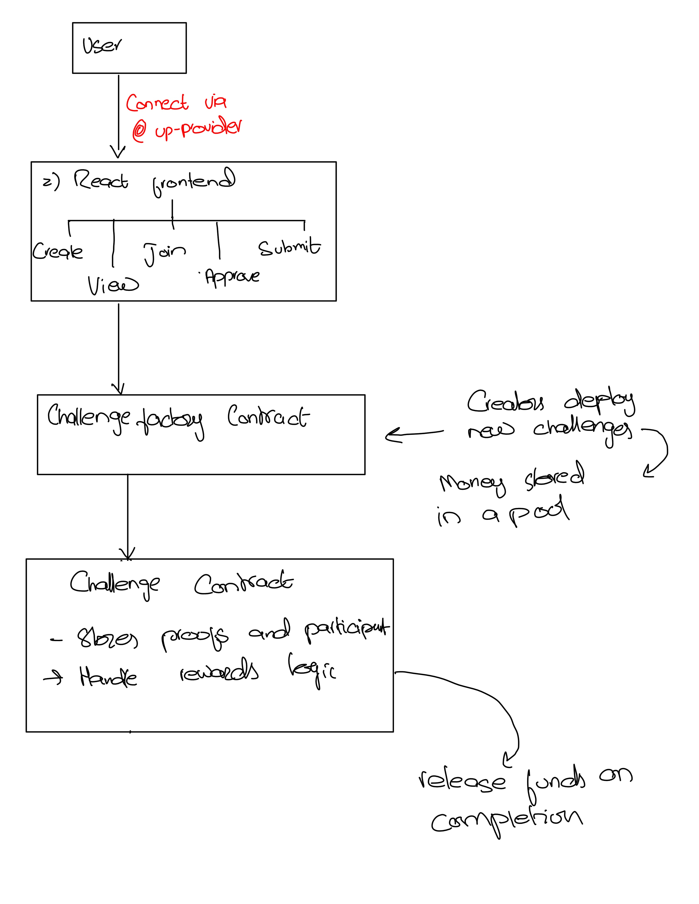

# Stakify

A blockchain-based micro-challenge staking app on LUKSO. With Stakify you can create fun mini-challenges, have participants submit proof, and distribute rewards automatically on-chain.

---

## Description

Stakify lets any Universal Profile holder become a challenge creator in just a few clicks. You stake some LYX to launch your challenge—anything from pushups to creative tasks—and participants submit a proof URL that you review. When you give the green light, each participant instantly receives a certain percent of your original stake, making the process transparent and trustless.

---

## Problem

* **Manual payouts are messy.** Relying on direct messages or spreadsheets to track completions and send rewards wastes time and introduces errors.
* **Lack of trust.** Participants often hesitate if they are unsure the creator will follow through with rewards.
* **Scalability issues.** As challenges go viral, manual verification and distribution become a bottleneck.

---

## Solution

Stakify solves these problems by putting everything on-chain:

1. **On-chain staking.** The creator locks LYX in the smart contract as a reward pool, visible to everyone.
2. **Proof submissions.** Participants call `completeChallenge(proofURL)` to record their submission in a single transaction.
3. **Click-to-approve.** The creator reviews the proof off-chain, then calls `approveProof(participant)` to automatically trigger a 2% payout to each approved participant.
4. **Pool management.** Unclaimed funds remain in the contract. The creator can top up the pool at any time or call `endChallenge()` to refund the remaining LYX back to their wallet.

---

## Technical Explanation

### Smart Contracts

**ChallengeFactory.sol**

* Deploys new `Challenge` contracts with a single function call.
* Forwards the creator’s stake into the new contract and records the address in a registry.

**Challenge.sol**

* Maintains key state variables: `creator`, `initialPool`, `remainingPool`, and `description`.
* Tracks each participant’s submission status in a `completed` mapping and approval status in an `approved` mapping, along with their `proofURL`.
* Implements four main functions:

  * `completeChallenge(string proofURL)`: Participants submit their proof.
  * `approveProof(address participant)`: Creator approves and pays out 2%.
  * `endChallenge()`: Creator retrieves any leftover LYX.
  * `receive()`: Allows the creator to add more LYX to the pool after deployment.

### Front-end (React + ethers.js)

* **Wallet integration.** MetaMask support for LUKSO Testnet, prompting users to connect.
* **Challenge creation form.** Enter a description and stake amount, then deploy a new challenge.
* **Challenge listings.** Fetch and display all existing challenges so users can browse and choose.
* **Proof submission.** Clicking “Complete” prompts for a URL and submits it on-chain.
* **Approval dashboard.** Creators see all pending proofs and approve them with a button click, triggering the reward distribution.


---
## Media




---
## Getting Started

1. **Clone the repository.**

   ```bash
   git clone https://github.com/yourusername/Stakify.git  
   cd Stakify  
   ```
2. **Install dependencies.**

   ```bash
   npm install  
   ```
3. **Configuration.** Create a `.env` file with your LUKSO Testnet RPC URL and private key:

   ```
   LUKSO_RPC=https://rpc.testnet.lukso.network  
   PRIVATE_KEY=0x...  
   ```
4. **Compile and deploy smart contracts.**

   ```bash
   npx hardhat compile  
   npx hardhat run scripts/deploy.js --network luksoTestnet  
   ```
5. **Run the front-end application.**

   ```bash
   npm start  
   ```
6. **Interact with Stakify.** Use MetaMask to create challenges, submit proofs, and distribute rewards.

---

## YouTube Walkthrough

Watch our step-by-step demo on YouTube to see Stakify in action:
[https://www.youtube.com/watch?v=BrXIcqvh_xw]

---

## Useful Links

* **LUKSO Testnet Explorer:** ([https://explorer.execution.testnet.lukso.network](https://explorer.execution.testnet.lukso.network/address/0x0b8deD28Ef0f69e9815B95DA6923d81B3fcba92C))
* **Deployed Factory Contract:** Paste this address in Universal Everything: ([https://capable-biscochitos-c0a80f.netlify.app/])
